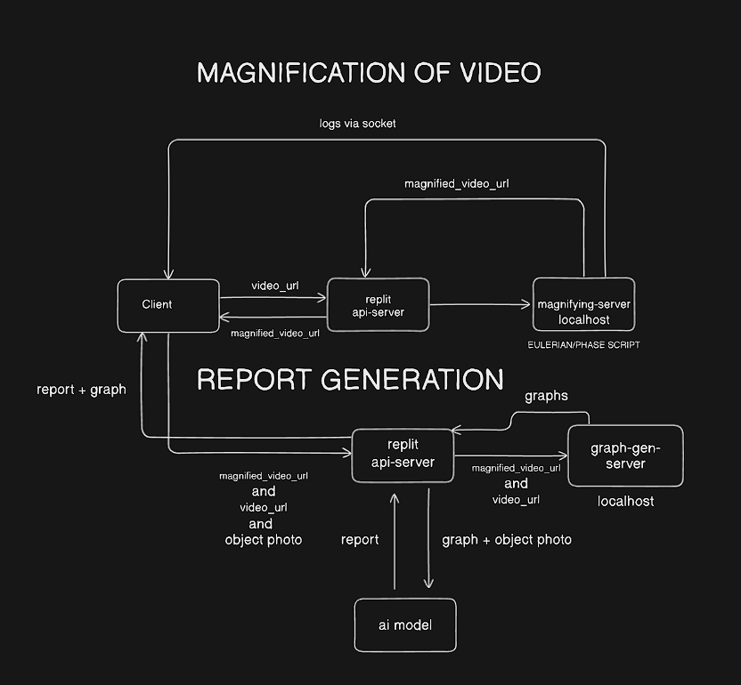
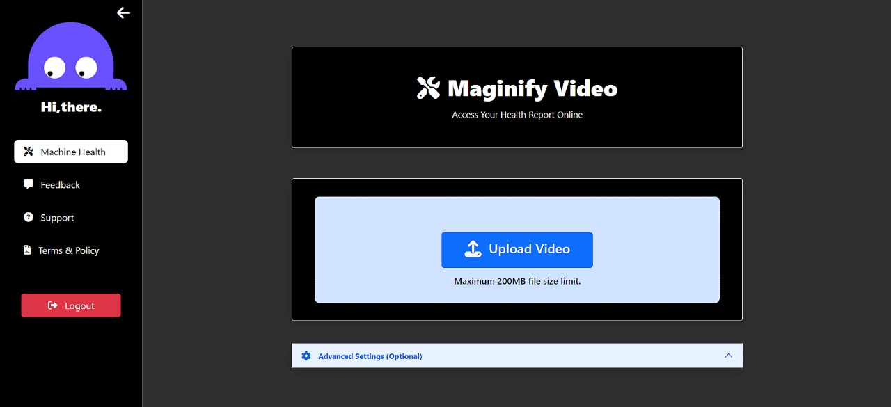

# System Architecture:


# Frontend:


# Analysis Report:


# Motion Amplification Vibration Monitoring System

The Motion Amplification Vibration Monitoring System is an innovative project aimed at merging human and machine health monitoring using cutting-edge technology. By harnessing Video Magnification, Computer Vision, and Machine Learning Algorithms, our system provides comprehensive insights into machinery and human well-being.

## Features

- **Eulerian Video Magnification**: Enhance video footage to make subtle motion patterns, vibrations, and color changes more visible.
- **Human Health Analysis**: Utilize video footage to examine human movements, generate health parameter graphs using computer vision, and provide detailed health reports using machine learning algorithms.
- **Use Cases**:
  - Respiratory Rate Monitoring: Identify irregular breathing patterns and track breath frequency.
  - Heart Rate Monitoring: Continuously monitor heart rate to assess cardiovascular health and fitness levels.
  - Aircraft Engine Health Analysis: Assess aircraft engine health by detecting vibrations and micro-scale defects to prevent unexpected failures.

## Dependencies

- Flask: Python web framework for backend development.
- OpenCV: Computer vision library for video processing.
- TensorFlow/Keras: Machine learning framework for developing health analysis models.

## Show Stoppers

- Universal Device Compatibility: Ensure flawless performance across a spectrum of devices, including web, windows and Android platforms.
- Real Time Motion Magnification using Frame-By-Frame Difference of Vibrations.

## Usage

1. Clone the repository:

   ```bash
   git clone https://github.com/preyanshu/video_magnification.git
   ```

2. Install dependencies:

   ```bash
   pip install -r requirements.txt
   ```

3. Run the Flask application:

   ```bash
   python app.py
   ```

4. Access the application through the provided URL in your web browser.


## Prototype Video For Magnification:
https://youtu.be/Ni9JRBwZUow


## Contributing

Contributions are welcome! Please open an issue or submit a pull request for any new features, improvements, or bug fixes.


